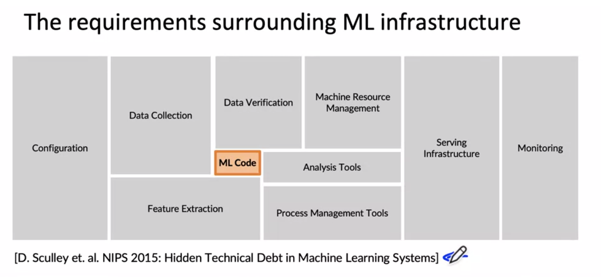
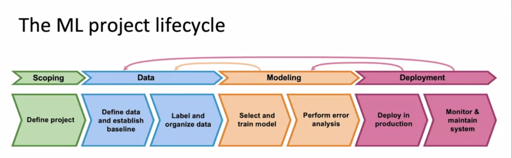

# Terms and Definitions

## Data Drift

- Data drift, also known as covariate shift, occurs when the distribution of the input data changes over time. For example, consider a machine learning model that was trained to predict the likelihood of a customer purchasing a product based on their age and income. If the distribution of ages and incomes of the customers changes significantly over time, the model may no longer be able to predict the likelihood of a purchase accurately.

## Requirements around ML Infrastructure

## ML project lifecycle

